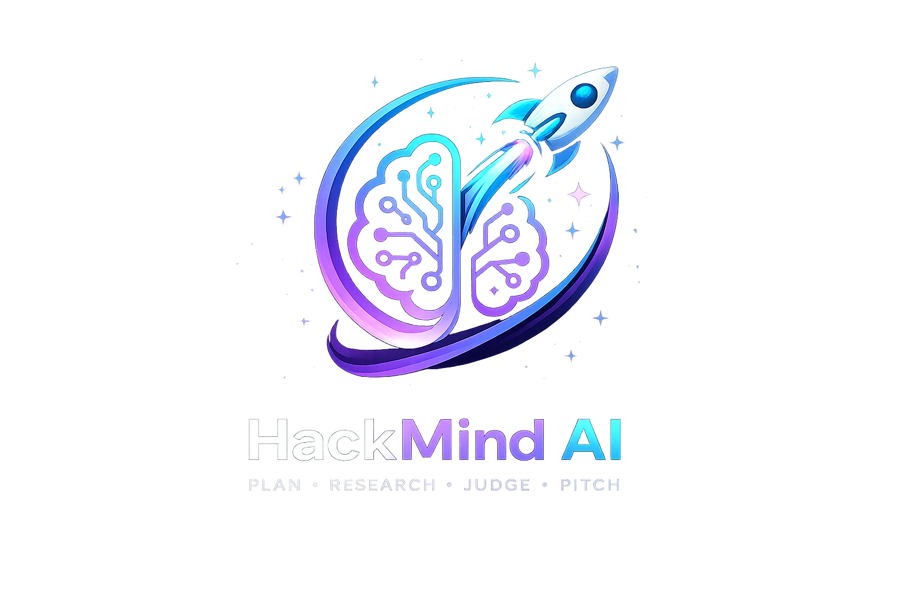
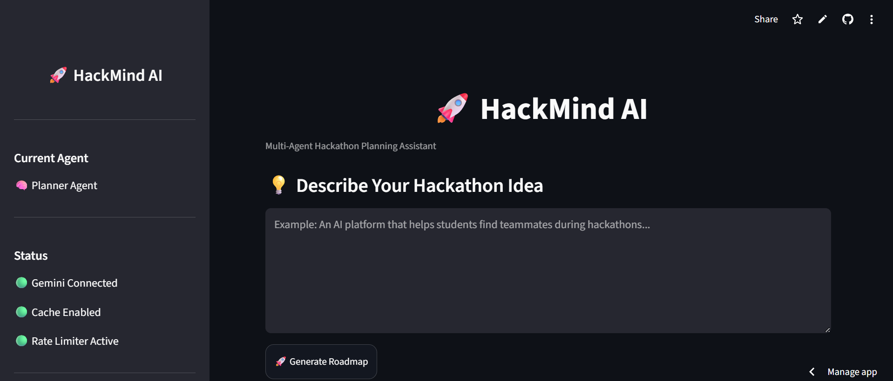
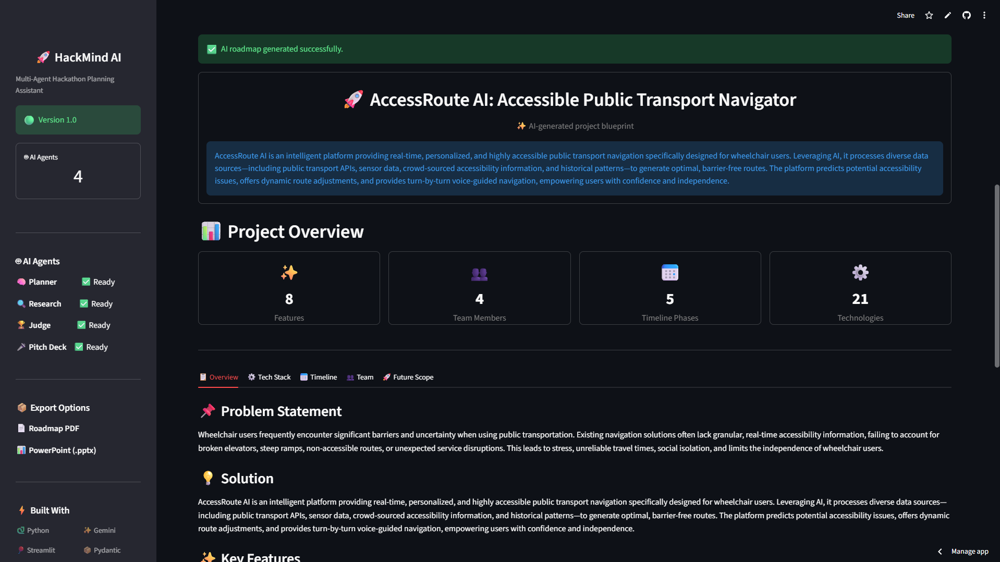

<p align="center">

</p>

<h1 align="center">
🚀 HackMind AI
</h1>

<p align="center">

Multi-Agent AI Platform for Planning Winning Hackathon Projects

Plan • Research • Judge • Pitch

</p>

<p align="center">


</p>

---

# 🌟 Overview

HackMind AI is an AI-powered multi-agent assistant designed to help students, developers, and hackathon teams transform an idea into a complete hackathon-ready project within minutes.

Instead of spending hours researching technologies, competitors, timelines, and presentation content, HackMind AI automatically generates everything required for a successful hackathon submission.

---

# ✨ Features

✅ AI Project Planner

Generate a complete roadmap including:

- Problem Statement
- Solution
- Features
- Tech Stack
- Timeline
- Team Roles
- Future Scope

---

✅ AI Research Agent

Automatically researches

- Similar Products
- Competitors
- APIs
- Risks
- Optimization Tips

---

✅ AI Judge Agent

Evaluates your project like a real hackathon judge.

Provides

- Overall Score
- Category Scores
- Strengths
- Weaknesses
- Improvements

---

✅ AI Pitch Deck Generator

Generates a professional presentation including

- Problem
- Solution
- Market
- Architecture
- Features
- Future Scope

Export directly as PowerPoint.

---

✅ Export Options

- PDF Roadmap
- PowerPoint Pitch Deck

---

# 🏗 System Architecture

```
User
   │
   ▼
🧠 Planner Agent
   │
   ▼
🔍 Research Agent
   │
   ▼
🏆 Judge Agent
   │
   ▼
🎤 Pitch Deck Agent
   │
   ▼
📄 PDF & PPT Export
```

---

# 📸 Screenshots

## 🏠 Landing Page



---

## 🧠 Planner Agent



---

## 🔍 Research Agent

*Screenshot coming soon.*

---

## 🏆 Judge Agent

*Screenshot coming soon.*

---

## 🎤 Pitch Deck

*Screenshot coming soon.*

---

## 📄 PDF Export

*Screenshot coming soon.*

---

## 📊 PowerPoint Export

*Screenshot coming soon.*

---

# ⚙ Tech Stack

### Frontend

- Streamlit

### Backend

- Python

### AI

- Google Gemini
- Prompt Engineering

### Data Validation

- Pydantic

### Document Generation

- ReportLab
- python-pptx

### Deployment

- Streamlit Community Cloud

---

# 🚀 Installation

Clone the repository

```bash
git clone https://github.com/shreyvirmani/HackMind-AI.git
```

Move inside

```bash
cd HackMind-AI
```

Install dependencies

```bash
pip install -r requirements.txt
```

Run

```bash
streamlit run app.py
```

---

# 📂 Project Structure

```
HackMind-AI

├── src
│
├── agents
├── controllers
├── exporters
├── models
├── parsers
├── prompts
├── services
├── ui
│
├── assets
├── app.py
├── requirements.txt
└── README.md
```

---

# 🛣 Roadmap

### ✅ Version 1.0

- Planner Agent
- Research Agent
- Judge Agent
- Pitch Deck Agent
- Modern UI
- Better Sidebar
- Improved Landing Page
- GitHub Branding

### 🚀 Coming Soon

- Team Builder Agent
- Demo Script Generator
- Business Model Generator
- Task Assignment Agent
- ZIP Export

---

# 🤝 Contributing

Contributions, issues and feature requests are welcome.

Feel free to fork the project and submit a Pull Request.

---

# 👨‍💻 Author

**Shrey Virmani**

**Github**:

https://github.com/shreyvirmani

**Linkedin**:

https://www.linkedin.com/in/shrey-virmani-1a352a325/

---

# ⭐ Support

If you found this project useful,

please consider giving it a ⭐ on GitHub.

It really helps and motivates future development.

---

Made using Python, Streamlit and Gemini AI.