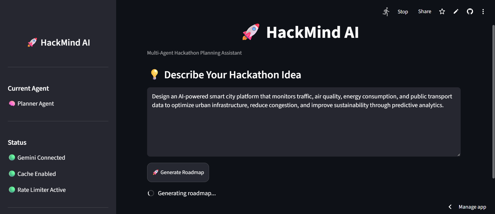

# 🚀 HackMind AI

> **An AI-powered Multi-Agent Hackathon Planning Assistant built with Google Gemini, Python, and Streamlit.**

HackMind AI helps transform a simple hackathon idea into a complete project roadmap with AI-generated planning, architecture suggestions, technology recommendations, development timelines, and team role allocation.

🌐 **Live Demo:** https://hackmind-ai.streamlit.app/

---

## ✨ Features

* AI-powered hackathon project planning
* Intelligent project roadmap generation
* Technology stack recommendations
* System architecture suggestions
* Development timeline creation
* Team role recommendations
* Modular AI agent architecture
* Response caching for faster performance
* Built-in API rate limiting
* Telemetry and performance monitoring
* Clean Streamlit dashboard
* Production-ready project structure

---

## 📸 Screenshots

### Home Page

> 

## Generating...

> 

### Generated Roadmap

> *(Add screenshot here)*

```
assets/screenshots/roadmap.png
```

---

## 🏗️ Architecture

```
User
   │
   ▼
Streamlit UI
   │
   ▼
Planner Controller
   │
   ▼
Planner Agent
   │
   ▼
LLM Manager
   │
   ├── Cache
   ├── Rate Limiter
   ├── Telemetry
   ▼
Google Gemini
```

---

## ⚙️ Tech Stack

### Frontend

* Streamlit

### Backend

* Python

### AI

* Google Gemini API
* Agent-based architecture

### Configuration

* Pydantic Settings
* Python Dotenv

### Utilities

* Logging
* Caching
* Rate Limiting
* Telemetry

### Future Technologies

* LangGraph
* Docker
* AWS
* PostgreSQL
* Redis

---

## 📂 Project Structure

```
HackMind-AI/
│
├── .github/
├── src/
│   ├── agents/
│   ├── config/
│   ├── controllers/
│   ├── models/
│   ├── prompts/
│   ├── services/
│   ├── ui/
│   └── utils/
│
├── app.py
├── requirements.txt
├── README.md
└── .env.example
```

---

## 🚀 Getting Started

### Clone the Repository

```bash
git clone https://github.com/shreyvirmani/HackMind-AI.git
cd HackMind-AI
```

### Create Virtual Environment

```bash
python -m venv venv
```

### Activate Environment

**Windows**

```bash
venv\Scripts\activate
```

**Linux / macOS**

```bash
source venv/bin/activate
```

### Install Dependencies

```bash
pip install -r requirements.txt
```

### Configure Environment Variables

Create a `.env` file.

```
GOOGLE_API_KEY=YOUR_API_KEY

PRIMARY_MODEL=gemini-2.5-flash
SECONDARY_MODEL=gemini-2.5-flash-lite
TERTIARY_MODEL=gemini-2.5-flash

MAX_RETRIES=3
REQUEST_DELAY=2
```

### Run the Application

```bash
streamlit run app.py
```

---

## 🛣️ Development Roadmap

### ✅ Completed

* Modular project architecture
* Planner Agent
* Gemini API integration
* LLM Manager
* Response caching
* API rate limiter
* Telemetry module
* Streamlit UI
* GitHub integration
* Streamlit Cloud deployment

### 🚧 In Progress

* Structured JSON output
* Professional dashboard
* Enhanced UI

### 🔜 Planned

* PDF export
* PowerPoint generation
* Research Agent
* Judge Agent
* Business Agent
* LangGraph orchestration
* Docker support
* AWS deployment
* CI/CD pipeline

---

## 🎯 Project Goals

* Build a production-quality AI application.
* Demonstrate agentic AI architecture.
* Showcase scalable software engineering practices.
* Create a portfolio project suitable for AI/ML internships and software engineering roles.

---

## 👨‍💻 Author

**Shrey Virmani**

GitHub: https://github.com/shreyvirmani

LinkedIn: https://www.linkedin.com/in/YOUR-LINKEDIN-USERNAME/
